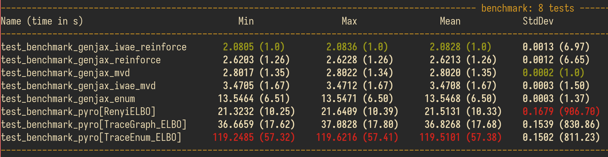
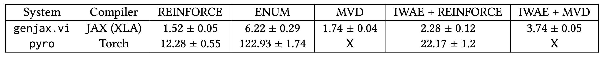

# Probabilistic programming with programmable variational inference

[](https://doi.org/10.5281/zenodo.10806202)

This repository contains the JAX implementation that accompanies the paper [_Probabilistic programming with programmable variational inference_](./pldi24_programmable_vi_original_submit.pdf), as well as the experiments used to generate figures and numbers in the empirical evaluation section.

**Table of contents**
* [Overview](#overview)
  + [Example](#example)
  + [Documentation](#documentation)
* [Reproducing the paper's claims](#reproducing-the-paper-s-claims)
  + [Setting up your environment](#setting-up-your-environment)
    - [Setup using `docker`](#setup-using--docker-)
    - [Setup using `poetry` and `just`](#setup-using--poetry--and--just-)
    - [GPU acceleration](#gpu-acceleration)
  + [Running the experiments](#running-the-experiments)
* [Interpreting the results](#interpreting-the-results)
  + [Abbreviations](#abbreviations)
  + [Correspondence between print out results and tables](#correspondence-between-print-out-results-and-tables)
* [Notes on artifact evaluation](#notes-on-artifact-evaluation)
* [Building on our work](#building-on-our-work)

<small><i><a href='http://ecotrust-canada.github.io/markdown-toc/'>Table of contents generated with markdown-toc</a></i></small>

## Overview

The artifact accompanying our paper is a Python library for probabilistic programming with variational inference.

Using our library, users can write *probabilistic programs* encoding probabilistic models and variational families. They can then define *variational objectives* to optimize, such as the ELBO. Our system can automate the estimation of gradients of these objectives, enabling gradient-based training.

### Example

For example, here is the model from Figure 2 of our paper, encoding a probability distribution on triples (x, y, z) located near a cone:

```python
import genjax
from genjax import gensp, vi

@genjax.gen
def model():
    x = vi.normal_reparam(0.0, 10.0) @ "x"
    y = vi.normal_reparam(0.0, 10.0) @ "y"
    rs = x**2 + y**2
    z = vi.normal_reparam(rs, 0.1 + (rs / 100.0)) @ "z"
```

Our goal will be to infer values of $x$ and $y$ consistent with an observation that $z = 5$:
```python
data = genjax.choice_map({"z": 5.0})
```

To do so, we define a *variational family* -- a parametric family of distributions over the latent variables (x, y).
```python
@genjax.gen
def variational_family(_, ϕ):
    μ1, μ2, log_σ1, log_σ2 = ϕ
    x = vi.normal_reparam(μ1, jnp.exp(log_σ1)) @ "x"
    y = vi.normal_reparam(μ2, jnp.exp(log_σ2)) @ "y"
```

We want to find parameters that minimize the [ELBO](https://en.wikipedia.org/wiki/Evidence_lower_bound), a loss function that encourages the variational family to be close to the Bayesian posterior over the latent variables:

```python
objective = vi.elbo(model, variational_family, data)
```

For convenience, the ELBO is defined as a library function, but users can also define their own objectives.

Our library can automatically estimate gradients of the ELBO and other probabilistic loss functions, and these gradients can be used to optimize the variational family's parameters.

```python
import jax
import jax.tree_util as jtu

# Training.
key = jax.random.PRNGKey(314159)
ϕ = (0.0, 0.0, 1.0, 1.0)
L = jax.jit(jax.vmap(objective.value_and_grad_estimate, in_axes=(0, None)))
for i in range(5000):
    key, sub_key = jax.random.split(key)
    sub_keys = jax.random.split(sub_key, 64)
    (loss, (_, (_, ϕ_grads))) = L(sub_keys, ((), (data, ϕ)))
    ϕ = jtu.tree_map(lambda v, g: v + 1e-3 * jnp.mean(g), ϕ, ϕ_grads)
```

The full code to run this example and plot results can be found in the `experiments/fig_2_noisy_cone` directory.

### Documentation

To ensure reproducibility, we have packaged a frozen version of our `genjax` library in this repository. Documentation is publicly available for the relevant modules, but please note that some APIs have changed since we submitted our paper, and the documentation may be out-of-sync with the code in this repository:
* [`adevjax`](https://probcomp.github.io/genjax/library/adev.html)
* [`genjax`](https://probcomp.github.io/genjax/library/index.html)
* [`genjax.vi`](https://probcomp.github.io/genjax/library/inference/vi.html)

For guidance on usage of the exact library version included in this artifact, please instead see our included tutorial notebook on [using and extending `genjax.vi`](./extending_our_work.ipynb).

## Reproducing the paper's claims

We have provided code to reproduce all of the experiments in the paper, namely the results in Figure 2, Figure 7, Table 1, Table 2, and Table 4. At a high level, these experiments validate our claims that (1) our implementation introduces minimal overhead compared to hand-coded gradient estimators, (2) our implementation of variational inference is faster than Pyro's, and on par with NumPyro's, for algorithms that all systems can express, and (3) our system supports gradient estimators that Pyro and NumPyro do not automate, some of which empirically converge faster than the algorithms they do support.

We've organized the experiments code under the `experiments` directory. The `experiments` directory contains the following subdirectories, which map onto the figures and tables in the submitted version of the paper:

* `fig_2_noisy_cone`
* `fig_7_air_estimator_evaluation`
* `table_1_minibatch_gradient_benchmark`
* `table_2_benchmark_timings`
* `table_4_objective_values`

Each directory contains code used to run the experiment, and also to reproduce the graphs or table results that appear in the submission.

**Computational cost of the experiments:** Some of the experiments can be run on CPU in a reasonable amount of time, whereas others require GPU. (See further discussion below.) For reference:

* (**CPU likely okay**) For `fig_2_noisy_cone` and `table_4_objective_values`, a CPU should be sufficient to run the experiments. These experiments illustrate usage of our system to automate gradient estimators for [hierarchical variational inference](https://arxiv.org/abs/1511.02386) (HVI), and nested importance weighted HVI.

* (**GPU likely required**) For `fig_7_air_estimator_evaluation`, `table_1_minibatch_gradient_benchmark`, and `table_2_benchmark_timings`, we recommend running on a GPU. These experiments illustrate various performance comparisons between our system, handcoded gradient estimators, and [Pyro](https://pyro.ai/) for several variational objectives and estimators.


### Setting up your environment

There are several possible ways to make an environment which can run the experiments.

#### Setup using `docker`

If you're planning to use the GPU, or are on a Linux device (this process will not work natively on Mac OS or Windows, due to `jaxlib`) -- possibly the easiest way is to use [`docker`](https://docs.docker.com/). There are two ways to use `docker` to build an environment:

* (**Docker Hub**) We've pushed [an image to Docker Hub](https://hub.docker.com/layers/probcomp/programmable-vi/latest/images/sha256-42a30281138c55509035b14ba7f42124262394fb559c151f36ad5d189b1f13a2?context=explore) which you can use directly.

* (**Dockerfile**) We've provided a `Dockerfile` with the repository. To build an image, run:
  ```
  docker build .
  ```
  This will proceed to build an image which you can use. 

Once you have a built image (either by building it yourself, or using the pre-built one from Docker Hub), you can then run a virtual machine using the image:

* **With GPU support (requires underlying Nvidia driver with support for CUDA 12)**

  If you have a Nvidia device and an installed driver with supports CUDA 12 (checked via `nvidia-smi`), you can run the image with GPU support:
  ```
  docker run --runtime nvidia -it <YOUR_IMAGE_ID>
  ```

  **NOTE**: you may need to install [the Nvidia container toolkit](https://docs.nvidia.com/datacenter/cloud-native/container-toolkit/latest/install-guide.html) ([github](https://github.com/NVIDIA/nvidia-container-toolkit)) to support usage of the `--runtime nvidia` flag with Docker.

* **Without GPU support**
  If you don't have access to a GPU, you can still run the image using (without GPU support):
  ```
  docker run -it <YOUR_IMAGE_ID>
  ```

In both cases, `<YOUR_IMAGE_ID>` is the hash of the image you built or the image you pulled from Docker Hub.

With this method, you can ignore the setup for `poetry` and `just` below, and jump to [GPU acceleration](https://github.com/probcomp/programmable-vi-pldi-2024/tree/main?tab=readme-ov-file#gpu-acceleration) (if you have access to a GPU) and then [Running the experiments](https://github.com/probcomp/programmable-vi-pldi-2024/tree/main?tab=readme-ov-file#running-the-experiments).

#### Setup using `poetry` and `just`

If you just want to run some of the experiments on CPU, or are on a Mac -- there's a recommended alternative path to setup a working Python environment: we utilize [`poetry`](https://python-poetry.org/docs/#installation) to manage Python dependencies, and utilize [`just`](https://github.com/casey/just) as a command runner. 

We recommend installing both of these tools, using the documentation at the links provided (at a bare minimum, you'll need to install `poetry`, but we also recommend installing `just` to utilize some of our convenience commands to run experiments).

With `poetry` installed, you can use `poetry install` to create and install our dependencies into a virtual environment. Run:
```
poetry install
```
to create and install dependencies into a virtual environment. Then, run:
```
poetry shell
```
to instantiate the virtual environment.


**Using `conda` with `poetry`**

Note that, if you're having issues with `poetry` environment creation via `poetry shell` or `poetry install` -- you can also managed a `conda` environment directly (by e.g using [`miniconda`](https://docs.anaconda.com/free/miniconda/)).

```
conda create --name programmable-vi-3.10.12 python=3.10.12
conda activate programmable-vi-3.10.12
poetry install
```

#### GPU acceleration

Several of our experiments are computationally intensive, and we recommend GPU acceleration.

For GPU acceleration, we assume access to a CUDA 12 enabled environment. There is a convenience command to install `torch` and `jaxlib` with support for CUDA 12:
```
just gpu
```
This will fetch versions of `torch` and `jaxlib` _which are compatible with each other_ (because we're benchmarking both `torch` and `jax`-enabled code). 

The versions we've selected for `torch` and `jaxlib` we've checked for compatibility on a device with Nvidia driver support up to CUDA 12.4 (as checked via `nvidia-smi`): if you want GPU acceleration, we recommend attempting to setup your system so that you can run this command successfully. If you have a CUDA 12 enabled system, you should be okay, but please report any issues to us on this repository.

### Running the experiments

> [!IMPORTANT] 
> Several of the experiments are computationally intensive, and may take a long time to run. We recommend running them on a machine with a GPU, and using `jax` and `torch` backend that supports GPU computation. 
> 
> In particular, `fig_7_air_estimator_evaluation` (`just fig_7`), `table_2_benchmark_timings` (`just table_2`), and `table_1_minibatch_gradient_benchmark` (`just table_1`) will take quite a long time on a CPU.

**Using `experiments.ipynb` to run experiments**

[There's a Jupyter notebook](./experiments.ipynb) which provides access to all the experiments via a single interface. Jupyter also allows you to view the PDFs generated by the experiments, either in the notebook directly, or via the file browser interface.

**Using `just` to run experiments**

To run _all of the experiments_, it suffices to run (**this will take a long time and not recommended on CPU**):

```
just run_all
```

The experiments will be run in order, and the figure results will be saved to the `./figs` directory at the top level as PDF files.

You can also run each experiment individually, the set of recipes available via `just` are:
```
❯ just -l
Available recipes:
    fig_2   # These are components for the overview figure for the paper.
    fig_7   # These are components for the AIR figure for the paper.
    gpu     # get GPU jax
    table_1 # Not a plot, just timings printed out.
    table_2 # Not a plot, just timings printed out using `pytest-benchmark`.
    table_4 # Not a plot, just timings printed out.
```

meaning that one can run any of these experiments using `just`, for example:

```
just table_1
```

## Interpreting the results

**Moving figures to your local device**
Note that, if you used Docker to run the experiments and produce figures into `./figs`, you can copy them to your local machine using `docker cp`:

```
docker cp <container id>:/home/wizard/figs /tmp
```

### Abbreviations

There are also several abbreviations which are not collected in a single place in the artifact:

* AIR -- _Attend, Infer, Repeat_, a generative model of multi-object images
* VAE -- variational autoencoder
* ELBO -- evidence lower bound
* MVD -- the measure valued derivative estimator
* REINFORCE -- the score function derivative estimator
* (IWELBO, or IWAE) -- importance weighted ELBO
* HVI -- hierarchical variational inference
* IWHVI -- importance weighted HVI
* DIWHVI -- doubly importance weighted HVI

### Correspondence between print out results and tables
Several of our experiments (the experiments which produce results for the tables) print out results to stdout. Below, we give a guide to interpreting the results:

**Sign convention** Systems which implement variational optimization can vary in terms of their sign convention for objective values. In our system, we consider _maximization_ (maximizing the ELBO). Pyro and NumPyro consider _minimization_ (minimizing the negative ELBO). These two processes are equivalent. Note that our print outs don't choose a standard, but our reported results do (we convert Pyro and NumPyro negative objective values to objective values by multiplying by -1).


* (**Table 1**): For Table 1, you'll see a print out which looks like the following (specific numbers will depend on your runtime environment):

  ```
  GenJAX VI timings:
  Batch sizes: [64, 128, 256, 512, 1024]
  (array([0.17483307, 0.23848654, 0.40820748, 0.74701416, 1.5442369 ], dtype=float32), 
   array([0.08583035, 0.06719527, 0.13345473, 0.24723288, 0.5431073 ], dtype=float32))
  Handcoded timings:
  Batch sizes: [64, 128, 256, 512, 1024]
  (array([0.13013603, 0.21644622, 0.43758354, 0.75196713, 1.5987686 ], dtype=float32), 
   array([0.03493173, 0.07299326, 0.18554626, 0.26609895, 0.55678135], dtype=float32))
  ```

  The "columns" of the print out match to the batch size: first array returned by the print out is the row of mean timings over several runs, the second row is the standard deviation of timings over those runs.

* (**Table 2**): To generate Table 2 in the paper, we use [`pytest-benchmark`](https://pypi.org/project/pytest-benchmark/) to generate timing statistics. The print out will likely look something like this (the specific numbers will depend on your runtime environment -- but the general trend, that our timings are orders of magnitude faster than Pyro, doesn't depend on runtime):

<p align="center">

</p>

  We took the `Mean` and `StdDev` column numbers to generate the results (of form $\text{Mean} \pm \text{StdDev}$) in our report's Table 2. 
  
<p align="center">

</p>

  The labels and the numbers for the columns in Table 2 are mapped from the names in the print out e.g. 
  * `genjax_reinforce` and `pyro[TraceGraph_ELBO]` -> REINFORCE
  * `genjax_mvd` -> MVD
  * `genjax_enum` and `pyro[TraceEnum_ELBO]` -> ENUM
  * `genjax_iwae_reinforce` and `pyro_reinforce[RenyiELBO]` -> IWAE + REINFORCE
  * `genjax_iwae_mvd` -> IWAE + MVD

  Each of the names on the right hand side of the arrows above correspond to particular _gradient estimators strategies_ used in variational inference. 

* (**Table 4**): For Table 4, (as mentioned in **Abbreviations**), you'll see a print out which looks like this:
  ```
  poetry run python experiments/table_4_objective_values/genjax_cone.py
  ELBO:
  (Array(-8.0759735, dtype=float32), Array(0.8189303, dtype=float32))
  IWAE(K = 5):
  (Array(-7.674431, dtype=float32), Array(2.659954, dtype=float32))

  poetry run python experiments/table_4_objective_values/genjax_cone_marginal.py
  HVI-ELBO(N = 1):
  (Array(-9.751299, dtype=float32), Array(0.9588641, dtype=float32))
  IWHVI(N = 5, K = 1):
  (Array(-8.182691, dtype=float32), Array(0.91353637, dtype=float32))
  IWHVI(N = 5, K = 5) (also called DIWHVI):
  (Array(-7.298371, dtype=float32), Array(1.6482085, dtype=float32))

  poetry run python experiments/table_4_objective_values/numpyro_cone.py
  100%|█████████████████████| 6000/6000 [00:01<00:00, 5377.34it/s, init loss: 450.7343, avg. loss [5701-6000]: 8.0853]
  NumPyro TraceGraph ELBO:
  (Array(8.087664, dtype=float32), Array(0.11515266, dtype=float32))
  100%|██████████████████████| 6000/6000 [00:01<00:00, 5432.70it/s, init loss: 71.4061, avg. loss [5701-6000]: 7.9096]
  NumPyro RenyiELBO(k = 5):
  (Array(7.869861, dtype=float32), Array(1.9360248, dtype=float32))

  poetry run python experiments/table_4_objective_values/pyro_cone.py
  Guessed max_plate_nesting = 1
  Pyro ELBO:
  (tensor(8.0826), tensor(0.1097))
  Guessed max_plate_nesting = 1
  Pyro IWAE(K = 5):
  (tensor(7.8314), tensor(2.4545))
  ```

  We've added spaces in the above example print out between the independent experiments involved in Table 4.

  A few things to note:
  * The IWAE label is equivalent to IWELBO, as is the RenyiELBO name (from the experiments on Pyro and NumPyro). 
  * All system comparison experiments (Pyro and NumPyro) are labeled with their names in this table. 
  * We did not report the standard deviation in this table: for each experiment, the first array is the mean over several trials, and the second is standard deviation.
  * Pyro and NumPyro use the negative ELBO as their objective (negative ELBO minimization), to compare with `genjax.vi` (and what we've done in Table 4) is apply a minus sign to the Pyro and NumPyro results.

## Notes on artifact evaluation

For our submission results, our hardware was a Linux box with a Nvidia RTX 4090, and an AMD Ryzen 7 7800x3D CPU, with CUDA support (checked via `nvidia-smi`) up to 12.4. 

We also ran our experiments on a Linux box with an Nvidia Tesla V100 SMX2 16 GB, and an Intel Xeon (8) @ 2.2 GHz, with support for CUDA 12. In both experiment environments, we observed the same general trends, including the same order-of-magnitude speed-ups of our JAX-based gradient estimators compared to Pyro's.

Note that even on GPU, Pyro's implementation of the reweighted wake-sleep (RWS) algorithm may be prohibitively slow (due to the `batch_size = 1` restriction).


## Building on our work
There are several ways to build on our work. We've provided [a tutorial notebook](./extending_our_work.ipynb) which provides an introduction to our system in the context of using it for variational inference on new model and guide programs.
