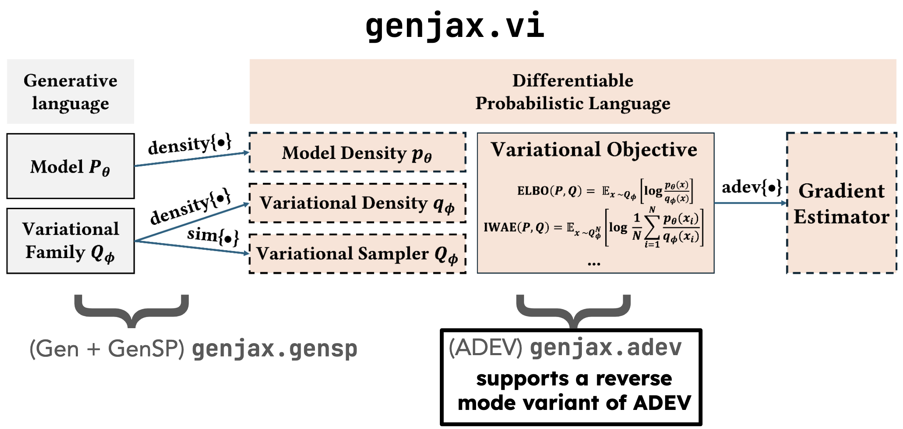

# Probabilistic programming with programmable variational inference
This repository contains the JAX implementation that accompanies the paper [_Probabilistic programming with programmable variational inference_](./pldi24_programmable_vi_original_submit.pdf), as well as the experiments used to generate figures and numbers in the empirical evaluation section.

## Overview



The architecture of our implementation is shown above. It consists of two main components:

* `adevjax`: a JAX-based prototype of [ADEV](https://dl.acm.org/doi/abs/10.1145/3571198), which also supports a reverse move variant.
* `genjax`: a JAX-based implementation of [the Gen probabilistic programming language](https://dl.acm.org/doi/10.1145/3314221.3314642)

The `genjax.vi` module combines these two components to automate the derivation of unbiased gradient estimators for variational inference objective functions.

**Note on available documentation**

Both `adevjax` and `genjax` are _private_ repositories: we've bundled specific versions of them for this artifact. However, there are public documentation pages for both:
* [`adevjax`](https://probcomp.github.io/genjax/library/adev.html)
* [`genjax`](https://probcomp.github.io/genjax/library/index.html)
* [`genjax.vi`](https://probcomp.github.io/genjax/library/inference/vi.html)

By virtue of the fact that the libraries are closed source (and under rapid development), the documentation pages may contain changes to the functionality of the code which is not accounted for in this artifact. We recommend referring to usage in the experiments and [the extensions notebook](./notebooks/extending_our_work.ipynb) for the most accurate information.

## Reproducing our results

We've organized the experiments code under the `experiments` directory. The `experiments` directory contains the following subdirectories (which map onto the figures and tables in the submitted version of the paper):

* `fig_2_noisy_cone`
* `fig_7_air_estimator_evaluation`
* `table_1_minibatch_gradient_benchmark`
* `table_2_benchmark_timings`
* `table_4_objective_values`

Each directory contains code used to create graphical components in the submission.

**Notes on runtime to support experiments**

(**CPU okay**) For `fig_2_noisy_cone` and `table_4_objective_values`, a local CPU device is sufficient to run the experiments. These experiments illustrate usage of our system to automate gradient estimators for [hierarchical variational inference](https://arxiv.org/abs/1511.02386) (HVI), and nested importance weighted HVI.

(**GPU likely required**) For `fig_7_air_estimator_evaluation`, `table_1_minibatch_gradient_benchmark`, and `table_2_benchmark_timings`, we recommend running on a GPU device. These experiments illustrate various performance comparisons between our system, handcoded gradient estimators, and [Pyro](https://pyro.ai/) for several variational objectives and estimators.

### Setting up your environment

We utilize [`poetry`](https://python-poetry.org/docs/#installation) to manage Python dependencies, and utilize [`just`](https://github.com/casey/just) as a command runner. At a bare minimum, you'll need to install `poetry`, but we also recommend installing `just` to utilize some of our convenience commands (to run experiments, and get compatible versions of `torch` and `jaxlib`).

With `poetry` installed, you can use `poetry shell` to create a virtual environment. Run:
```
poetry shell
poetry install
```
to instantiate a virtual environment and install the Python dependencies.

#### GPU acceleration

Several of our experiments are computationally intensive, and we recommend GPU acceleration.

For GPU acceleration, we assume access to a CUDA 11 enabled environment. There is a convenience command to install `torch` and `jaxlib` with support for CUDA 11:
```
just gpu
```
This will fetch versions of `torch` and `jaxlib` _which are compatible with each other_ (because we're benchmarking both `torch` and `jax`-enabled code). 

The versions we've selected we've guaranteed for compatibility, so we recommend attempting to setup your system so that you can run this command successfully. If you have a CUDA 11 enabled system, and you ran `poetry install` as above, you should be okay.

### Running the experiments

> [!IMPORTANT] 
> Several of the experiments are computationally intensive, and may take a long time to run. We recommend running them on a machine with a GPU, and using `jax` and `torch` backend that supports GPU computation. 
> 
> In particular, `fig_7_air_estimator_evaluation` (`just fig_7`), `table_2_benchmark_timings` (`just table_2`), and `table_1_minibatch_gradient_benchmark` (`just table_1`) will take quite a long time on a CPU.

**Using `just` to run experiments**

To run _all of the experiments_, it suffices to run (**this will take a long time**):

```
just run_all
```

The experiments will be run in order, and the figure results will be saved to the `./fig` directory at the top level as PDF files.

You can also run each experiment individually, the set of recipes available via `just` are:
```
❯ just -l
Available recipes:
    fig_2   # These are components for the overview figure for the paper.
    fig_7   # These are components for the AIR figure for the paper.
    gpu     # get GPU jax
    table_1 # Not a plot, just timings printed out.
    table_2 # Not a plot, just timings printed out using `pytest-benchmark`.
    table_4 # Not a plot, just timings printed out.
```

meaning that one can run any of these experiments using `just`, for example:

```
just table_1
```

## Notes on artifact evaluation

> Some of the results are performance data, and therefore exact numbers depend on the particular hardware. In this case, artifacts should explain how to recognize when experiments on other hardware reproduce the high-level results (e.g., that a certain optimization exhibits a particular trend, or that comparing two tools one outperforms the other in a certain class of cases).

For our submission to PLDI, our hardware was a Linux box with a Nvidia RTX 4090, and an AMD Ryzen 9 5950X. We also ran our experiments on a Linux box with an Nvidia Tesla V100 SMX2 16 GB, and an Intel Xeon (8) @ 2.2 GHz. The high-level claims of our paper (that we provide a sound denotational account of variational inference, and that our system provides automation to support exploration of new gradient estimation strategies for variational inference) are hardware independent.

In both experiment environments, we observed the same order of magnitude speed up on epoch training sweeps for our JAX implementation of gradient estimators over Pyro.

> In some cases repeating the evaluation may take a long time. Reviewers may not reproduce full results in such cases.

In this artifact, we've omitted experiments involving Pyro's reweighted-wake (RWS) sleep implementation, as we found that the runtime was prohibitively long (training for the same number of epochs as the rest of our benchmarks would have lasted a day, or longer).


## Extending our work
There are several ways to extend our work. We've provided [a tutorial notebook](./notebooks/extending_our_work.ipynb) which covers a few of these ways:
* (**Extending ADEV, the automatic differentiation algorithm, with new samplers equipped with gradient strategies.**) After implementing the ADEV interfaces for these objects, they can be freely lifted into the `Distribution` type of our language, and can be used in modeling and guide code. We illustrate this process by implementing `beta_implicit`, and using it in a model and guide program from the Pyro tutorials.
* (**Implementing new loss functions, by utilizing the modeling interfaces in our language.**) We illustrate this process by implementing [SDOS](https://arxiv.org/abs/2103.01030), an estimator for a symmetric KL divergence, using our language and automated the derivation of gradients for a guide program.
* (**Using a standard loss function (like `genjax.vi.elbo`) with new models and guides.**) By virtue of the programmability of our system, this is a standard means of extending our work. This extension is covered in the tutorial for the first case, above.
