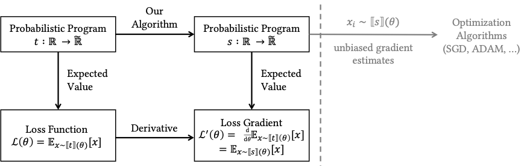
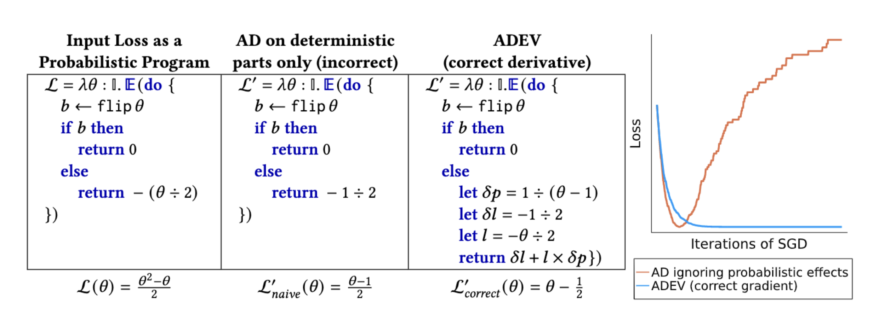

# adevjax



> A JAX encoding of [ADEV: Sound Automatic Differentiation of Expected Values of Probabilistic Programs](https://arxiv.org/pdf/2212.06386.pdf).

<div align="center">

[![][jax_badge]](https://github.com/google/jax)
[](https://github.com/psf/black)
[](https://beartype.readthedocs.io)

|            **Build status**             |
| :-------------------------------------: |
| [![][main_build_action_badge]][actions] |

</div>

<div align="center">

**Other implementations:** ([Haskell implementation](https://github.com/probcomp/adev/tree/main) & [Julia implementation](https://github.com/probcomp/ADEV.jl))

</div>

## Overview

ADEV is a method of automatically differentiating loss functions defined as _expected values_ of probabilistic processes. ADEV users define a _probabilistic program_ $t$, which, given a parameter of type $\mathbb{R}$ (or a subtype), outputs a value of type $\widetilde{\mathbb{R}}$,
which represents probabilistic estimators of losses. We translate $t$ to a new probabilistic program $s$,
whose expected return value is the derivative of $t$’s expected return value. Running $s$ yields provably unbiased
estimates $x_i$ of the loss's derivative, which can be used in the inner loop of stochastic optimization algorithms like ADAM or stochastic gradient descent.

ADEV goes beyond standard AD by explicitly supporting probabilistic primitives (like `flip`, for flipping a coin). If these probabilistic constructs are ignored, standard AD may produce incorrect results, as this figure from our paper illustrates:



In this example, standard AD fails to account for the parameter $\theta$'s effect on the _probability_ of entering each branch. ADEV, by contrast, correctly accounts
for the probabilistic effects, generating similar code to what a practitioner might hand-derive. Correct
gradients are often crucial for downstream applications, e.g. optimization via stochastic gradient descent.

ADEV compositionally supports various gradient estimation strategies from the literature, including:

- Reparameterization trick (Kingma & Welling 2014)
- Score function estimator (Ranganath et al. 2014)
- Baselines as control variates (Mnih and Gregor 2014)
- Multi-sample estimators that Storchastic supports (e.g. leave-one-out baselines) (van Krieken et al. 2021)
- Variance reduction via dependency tracking (Schulman et al. 2015)
- Special estimators for differentiable particle filtering (Ścibior et al. 2021)
- Implicit reparameterization (Figurnov et al. 2018)
- Measure-valued derivatives (Heidergott and Vázquez-Abad 2000)
- Reparameterized rejection sampling (Nasseth et al. 2017)

## Self-contained example

```python
import jax
import jax.numpy as jnp

import adevjax
from adevjax import E
from adevjax import adev
from adevjax import bernoulli
from adevjax import enum
from adevjax import reinforce
from adevjax import sample

# Sets up pretty printing + good stack traces.
console = adevjax.pretty(max_frames=100, show_locals=False)

# PRNG key initialization.
key = jax.random.PRNGKey(314159)

# The exact expectation is: (p² - p) / 2
# The exact gradient is: (p - 1/2)
@adev
def flip_exact_loss(p):
    b = flip_enum(p)
    return jax.lax.cond(
        b,
        lambda _: 0.0,
        lambda p: -p / 2.0,
        p,
    )

# The E operator denotes ADEV's expectation operator - it produces a callable object
# which exposes `jvp_estimate` and `grad_estimate`.
v, p_tangent = jax.jit(E(flip_exact_loss).jvp_estimate)(
    key,  # PRNG key
    (0.7,),  # Primals
    (1.0,),  # Tangents
)
console.print((v, p_tangent))

# Reverse mode.
p_grad = jax.jit(E(flip_exact_loss).grad_estimate)(
    key,  # PRNG key
    (0.7,),  # Primals
)
console.print(p_grad)
```

## Development environment

This project uses:

- [poetry](https://python-poetry.org/) for dependency management
- [nox](https://nox.thea.codes/en/stable/) to automate testing/linting/building.
- [mkdocs](https://www.mkdocs.org/) to generate static documentation.

### (Option 1): Development environment setup with `poetry`

#### Step 1: Setting up the environment with `poetry`

[First, you should install `poetry` to your system.](https://python-poetry.org/docs/#installing-with-the-official-installer)

Assuming you have `poetry`, here's a simple script to setup a compatible development environment - if you can run this script, you have a working development environment which can be used to execute tests, build and serve the documentation, etc.

```bash
conda create --name adevjax-py311 python=3.11 --channel=conda-forge
conda activate adevjax-py311
pip install nox
pip install nox-poetry
git clone https://github.com/probcomp/adevjax
cd adevjax
poetry install
poetry run jupyter-lab
```

You can test your environment with:

```bash
nox -r
```

#### Step 2: Choose a `jaxlib`

`adevjax` does not manage the version of `jaxlib` that you use in your execution environment. The exact version of `jaxlib` can change depending upon the target deployment hardware (CUDA, CPU, Metal). It is your responsibility to install a version of `jaxlib` which is compatible with the JAX bounds (`jax = "^0.4.10"` currently) in `adevjax` (as specified in `pyproject.toml`).

[For further information, see this discussion.](https://github.com/google/jax/discussions/16380)

[You can likely install CUDA compatible versions by following environment setup above with a `pip` installation of the CUDA-enabled JAX.](https://github.com/google/jax#pip-installation-gpu-cuda-installed-via-pip-easier)

### (Option 2): Self-managed development environment with `requirements.txt`

#### Using `requirements.txt`

> **This is not the recommended way to develop on `adevjax`**, but may be required if you want to avoid environment collisions with `adevjax` installing specific versions of `jax` and `jaxlib`.

`adevjax` includes a `requirements.txt` file which is exported from the `pyproject.toml` dependency requirements -- but with `jax` and `jaxlib` removed.

If you wish to setup a usable environment this way, you must ensure that you have `jax` and `jaxlib` installed in your environment, then:

```bash
pip install -r requirements.txt
```

This should install a working environment - subject to the conditions that your version of `jax` and `jaxlib` resolve with the versions of packages in the `requirements.txt`

### Documentation environment setup

In addition, you'll need `mkdocs`:

```bash
pip install mkdocs
```

`adevjax` builds documentation using an insiders-only version of [mkdocs-material](https://squidfunk.github.io/mkdocs-material/). `adevjax` will attempt to fetch this repository during the documentation build step.

With these dependencies installed (`mkdocs` into your active Python environment) and on path, you can fully build the documentation:

```bash
nox -r -s docs-build
```

This command will use `mkdocs` to build the static site.

Pushing the resulting changes to the `main` branch will trigger a CI job to deploy to the GitHub Pages branch `gh-pages`, from which the documentation is hosted.

[main_build_action_badge]: https://github.com/probcomp/adevjax/actions/workflows/ci.yml/badge.svg?style=flat-square
[actions]: https://github.com/probcomp/adevjax/actions
[jax_badge]: https://img.shields.io/badge/JAX-Accelerated-9cf.svg?style=flat-square&logo=data:image/png;base64,iVBORw0KGgoAAAANSUhEUgAAAC0AAAAaCAYAAAAjZdWPAAAIx0lEQVR42rWWBVQbWxOAkefur%2B7u3les7u7F3ZIQ3N2tbng8aXFC0uAuKf2hmlJ3AapIgobMv7t0w%2Ba50JzzJdlhlvNldubeq%2FY%2BXrTS1z%2B6sttrKfQOOY4ns13ecFImb47pVvIkukNe4y3Junr1kSZ%2Bb3Na248tx7rKiHlPo6Ryse%2F11NKQuk%2FV3tfL52yHtXm8TGYS1wk4J093wrPQPngRJH9HH1x2fAjMhcIeIaXKQCmd2Gn7IqSvG83BueT0CMkTyESUqm3vRRggTdOBIb1HFDaNl8Gdg91AFGkO7QXe8gJInpoDjEXC9gbhtWH3rjZ%2F9yK6t42Y9zyiC1iLhZA8JQe4eqKXklrJF0MqfPv2bc2wzPZjpnEyMEVlEZCKQzYCJhE8QEtIL1RaXEVFEGmEaTn96VuLDzWflLFbgvqUec3BPVBmeBnNwUiakq1I31UcPaTSR8%2B1LnditsscaB2A48K6D9SoZDD2O6bELvA0JGhl4zIYZzcWtD%2BMfdvdHNsDOHciXwBPN18lj7sy79qQCTNK3nxBZXakqbZFO2jHskA7zBs%2BJhmDmr0RhoadIZjYxKIVHpCZngPMZUKoQKrfEoz1PfZZdKAe2CvP4XnYE8k2LLMdMumwrLaNlomyVqK0UdwN%2BD7AAz73dYBpPg6gPiCN8TXFHCI2s7AWYesJgTabD%2FS5uXDTuwVaAvvghncTdk1DYGkL0daAs%2BsLiutLrn0%2BRMNXpunC7mgkCpshfbw4OhrUvMkYo%2F0c4XtHS1waY4mlG6To8oG1TKjs78xV5fAkSgqcZSL0GoszfxEAW0fUludRNWlIhGsljzVjctr8rJOkCpskKaDYIlgkVoCmF0kp%2FbW%2FU%2F%2B8QNdXPztbAc4kFxIEmNGwKuI9y5gnBMH%2BakiZxlfGaLP48kyj4qPFkeIPh0Q6lt861zZF%2BgBpDcAxT3gEOjGxMDLQRSn9XaDzPWdOstkEN7uez6jmgLOYilR7NkFwLh%2B4G0SQMnMwRp8jaCrwEs8eEmFW2VsNd07HQdP4TgWxNTYcFcKHPhRYFOWLfJJBE5FefTQsWiKRaOw6FBr6ob1RP3EoqdbHsWFDwAYvaVI28DaK8AHs51tU%2BA3Z8CUXvZ1jnSR7SRS2SnwKw4O8B1rCjwrjgt1gSrjXnWhBxjD0Hidm4vfj3e3riUP5PcUCYlZxsYFDK41XnLlUANwVeeILFde%2BGKLhk3zgyZNeQjcSHPMEKSyPPQKfIcKfIqCf8yN95MGZZ1bj98WJ%2BOorQzxsPqcYdX9orw8420jBQNfJVVmTOStEUqFz5dq%2F2tHUY3LbjMh0qYxCwCGxRep8%2FK4ZnldzuUkjJLPDhkzrUFBoHYBjk3odtNMYoJVGx9BG2JTNVehksmRaGUwMbYQITk3Xw9gOxbNoGaA8RWjwuQdsXdGvpdty7Su2%2Fqn0qbzWsXYp0nqVpet0O6zzugva1MZHUdwHk9G8aH7raHua9AIxzzjxDaw4w4cpvEQlM84kwdI0hkpsPpcOtUeaVM8hQT2Qtb4ckUbaYw4fXzGAqSVEd8CGpqamj%2F9Q2pPX7miW0NlHlDE81AxLSI2wyK6xf6vfrcgEwb0PAtPaHM1%2BNXzGXAlMRcUIrMpiE6%2Bxv0cyxSrC6FmjzvkWJE3OxpY%2BzmpsANFBxK6RuIJvXe7bUHNd4zfCwvPPh9unSO%2BbIL2JY53QDqvdbsEi2%2BuwEEHPsfFRdOqjHcjTaCLmWdBewtKzHEwKZynSGgtTaSqx7dwMeBLRhR1LETDhu76vgTFfMLi8zc8F7hoRPpAYjAWCp0Jy5dzfSEfltGU6M9oVCIATnPoGKImDUJNfK0JS37QTc9yY7eDKzIX5wR4wN8RTya4jETAvZDCmFeEPwhNXoOlQt5JnRzqhxLZBpY%2BT5mZD3M4MfLnDW6U%2Fy6jkaDXtysDm8vjxY%2FXYnLebkelXaQtSSge2IhBj9kjMLF41duDUNRiDLHEzfaigsoxRzWG6B0kZ2%2BoRA3dD2lRa44ZrM%2FBW5ANziVApGLaKCYucXOCEdhoew5Y%2Btu65VwJqxUC1j4lav6UwpIJfnRswQUIMawPSr2LGp6WwLDYJ2TwoMNbf6Tdni%2FEuNvAdEvuUZAwFERLVXg7pg9xt1djZgqV7DmuHFGQI9Sje2A9dR%2FFDd0osztIRYnln1hdW1dff%2B1gtNLN1u0ViZy9BBlu%2BzBNUK%2BrIaP9Nla2TG%2BETHwq2kXzmS4XxXmSVan9KMYUprrbgFJqCndyIw9fgdh8dMvzIiW0sngbxoGlniN6LffruTEIGE9khBw5T2FDmWlTYqrnEPa7aF%2FYYcPYiUE48Ul5jhP82tj%2FiESyJilCeLdQRpod6No3xJNNHeZBpOBsiAzm5rg2dBZYSyH9Hob0EOFqqh3vWOuHbFR5eXcORp4OzwTUA4rUzVfJ4q%2FIa1GzCrzjOMxQr5uqLAWUOwgaHOphrgF0r2epYh%2FytdjBmUAurfM6CxruT3Ee%2BDv2%2FHAwK4RUIPskqK%2Fw4%2FR1F1bWfHjbNiXcYl6RwGJcMOMdXZaEVxCutSN1SGLMx3JfzCdlU8THZFFC%2BJJuB2964wSGdmq3I2FEcpWYVfHm4jmXd%2BRn7agFn9oFaWGYhBmJs5v5a0LZUjc3Sr4Ep%2FmFYlX8OdLlFYidM%2B731v7Ly4lfu85l3SSMTAcd5Bg2Sl%2FIHBm3RuacVx%2BrHpFcWjxztavOcOBcTnUhwekkGlsfWEt2%2FkHflB7WqKomGvs9F62l7a%2BRKQQQtRBD9VIlZiLEfRBRfQEmDb32cFQcSjznUP3um%2FkcbV%2BjmNEvqhOQuonjoQh7QF%2BbK811rduN5G6ICLD%2BnmPbi0ur2hrDLKhQYiwRdQrvKjcp%2F%2BL%2BnTz%2Fa4FgvmakvluPMMxbL15Dq5MTYAhOxXM%2FmvEpsoWmtfP9RxnkAIAr%2F5pVxqPxH93msKodRSXIct2l0OU0%2FL4eY506L%2B3GyJ6UMEZfjjCDbysNcWWmFweJP0Jz%2FA0g2gk80pGkYAAAAAElFTkSuQmCC
